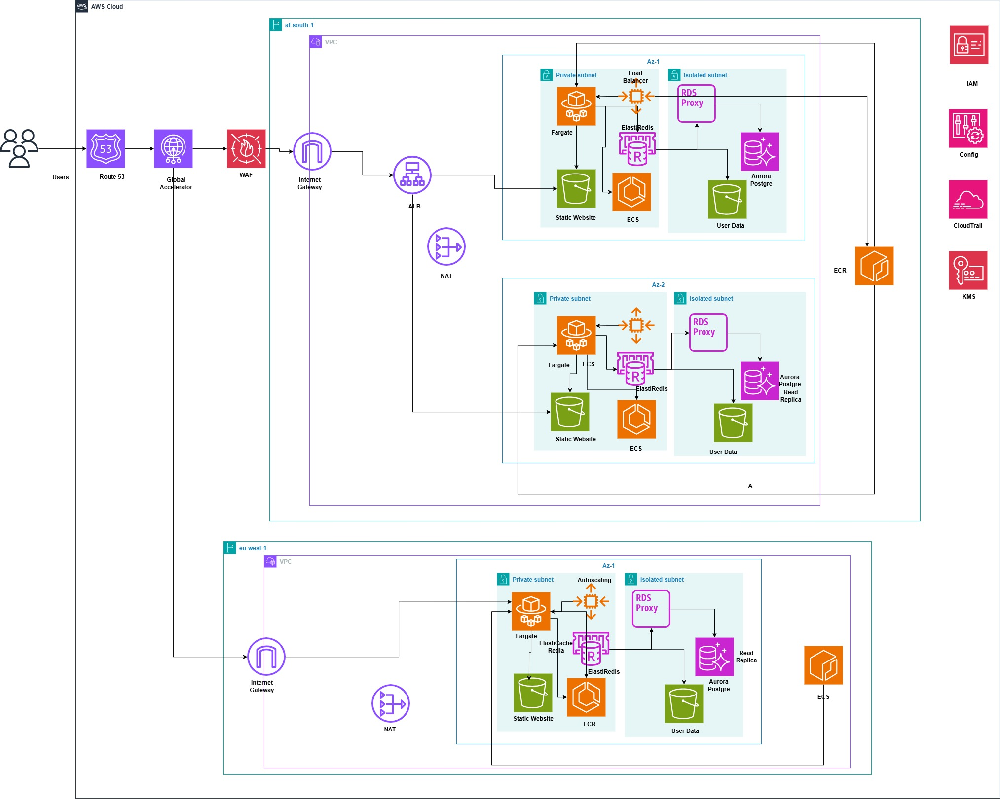

# AWS Cloud Architecture for a Nigerian B2B Financial Application

## 1. Project Overview

This project focuses on designing a resilient, scalable, secure, and cost-efficient AWS cloud architecture for a Nigerian B2B company with approximately **340 customers** and daily transaction volumes exceeding **₦180 million**.

The company's application currently operates on a relatively simple architecture consisting of **Amazon EC2, Amazon S3, and Amazon RDS**. While this architecture supports the current workload, it presents significant limitations in terms of **high availability, fault tolerance, disaster recovery, scalability, and operational resilience**.

The business also experiences predictable **traffic spikes toward the end of each month**, creating additional demand on the application infrastructure. The existing architecture has limited redundancy, creating a higher risk of service disruption if a critical infrastructure component becomes unavailable.

The objective of this project is to redesign the application architecture using AWS services to address the company's business and technical requirements while maintaining **data residency within Nigeria**.

The proposed architecture is designed to provide:

* **99.95% uptime SLA**
* **Recovery Time Objective (RTO) of 15 minutes**
* **Recovery Point Objective (RPO) of 5 minutes**
* Ability to handle **10× normal peak load**
* Protection of sensitive financial data through encryption
* Comprehensive auditability and monitoring
* Resilient infrastructure with minimal downtime
* Cost-efficient resource utilization
* Disaster recovery capabilities while maintaining Nigerian data residency

---

## 2. Business Context

| Business Factor          |                        Requirement |
| ------------------------ | ---------------------------------: |
| Customer Base            |                     ~340 customers |
| Daily Transaction Volume |                     > ₦180 million |
| Traffic Pattern          | Predictable monthly traffic spikes |
| Current Infrastructure   |                     EC2 + S3 + RDS |
| Data Location            |                            Nigeria |
| Availability Target      |                      99.95% uptime |
| Recovery Time Objective  |                       ≤ 15 minutes |
| Recovery Point Objective |                        ≤ 5 minutes |
| Peak Load Requirement    |                    10× normal load |

---

## 3. Business Requirements

The architecture must satisfy the following business requirements.

### 3.1 High Availability

**Requirement:** Maintain a **99.95% uptime SLA**.

The application must remain available despite individual infrastructure failures. The architecture should eliminate single points of failure and provide redundancy across appropriate AWS Availability Zones.

### 3.2 Data Residency

**Requirement:** All sensitive business and financial data must remain within **Nigeria**.

The architecture must use AWS infrastructure located in Nigeria where available and ensure that data storage, processing, backup, and disaster recovery strategies comply with the organization's data residency requirement.

### 3.3 Disaster Recovery

**Requirement:** The system must achieve:

* **RTO ≤ 15 minutes**
* **RPO ≤ 5 minutes**

The disaster recovery strategy must allow the application to be restored within 15 minutes following a major infrastructure failure while limiting potential data loss to a maximum of 5 minutes.

### 3.4 Peak Load Handling

**Requirement:** The system must handle up to **10× the normal workload** during peak periods.

The architecture should be horizontally scalable and capable of dynamically increasing capacity during predictable traffic spikes without requiring permanent provisioning for peak capacity.

### 3.5 Financial Data Protection

**Requirement:** Sensitive financial and customer data must be encrypted.

Encryption should be applied to data **at rest and in transit**, with appropriate key management and access controls.

### 3.6 Audit Trail

**Requirement:** Business and infrastructure activities must be auditable.

The architecture must provide centralized logging and auditing of relevant activities, including API activity, administrative actions, infrastructure changes, and access to sensitive resources.

### 3.7 Cost Efficiency

**Requirement:** Achieve the required availability, resilience, security, and scalability without unnecessary infrastructure expenditure.

The architecture should make use of managed AWS services, automated scaling, appropriate storage tiers, and resource optimization where possible.

---

## 4. Architecture Objectives

Based on the business requirements, the proposed architecture aims to:

1. Remove critical single points of failure from the existing infrastructure.
2. Provide highly available application and database infrastructure.
3. Automatically scale to accommodate traffic spikes.
4. Provide a disaster recovery mechanism capable of meeting the **15-minute RTO and 5-minute RPO** targets.
5. Protect sensitive financial information through encryption and strict access controls.
6. Provide centralized monitoring, logging, and auditing.
7. Keep required business data within Nigeria.
8. Optimize infrastructure costs while maintaining the required service levels.

---

## 5. Architecture Diagram

The proposed AWS architecture is shown below:

---

## 6. Architecture Overview

The architecture is designed around the principles of:

* **High Availability**
* **Fault Tolerance**
* **Scalability**
* **Security**
* **Disaster Recovery**
* **Cost Optimization**

The detailed architecture and interaction between AWS services are documented in:

**[Architecture Overview](architecture/architecture-overview.md)**

---

## 7. Architecture Decisions

Major architectural decisions are documented in:

**[Architecture Decisions](architecture/architecture-decisions.md)**

These decisions explain the reasoning behind the selection of AWS services and architectural patterns based on the defined business requirements.

---

## 8. Security

Security considerations include:

* Encryption of sensitive data at rest and in transit
* IAM-based access control
* Least-privilege permissions
* Network segmentation
* Secure database access
* Centralized logging and auditing
* Key management
* Protection of sensitive financial information

Detailed security controls can be found in:

**[Security Documentation](documentation/security.md)**

---

## 9. Disaster Recovery

The disaster recovery strategy is designed around the business-defined:

| Metric  |       Target |
| ------- | -----------: |
| **RTO** | ≤ 15 minutes |
| **RPO** |  ≤ 5 minutes |

The recovery architecture, replication strategy, backup mechanisms, failover process, and recovery workflow are documented in:

**[Disaster Recovery Documentation](documentation/disaster-recovery.md)**

---

## 10. Scalability

The architecture is designed to accommodate the company's predictable end-of-month traffic spikes.

The target is to support up to **10× the normal workload** through horizontal scaling and appropriate AWS managed services.

Detailed scaling mechanisms are documented in:

**[Scalability Documentation](documentation/scalability.md)**

---

## 11. Monitoring & Auditing

The architecture incorporates monitoring and auditing capabilities to provide visibility into:

* Application health
* Infrastructure health
* Resource utilization
* Security events
* API activity
* Configuration changes
* System failures

Detailed monitoring and logging configurations are documented in:

**[Monitoring & Logging Documentation](documentation/monitoring-and-logging.md)**

---

## 12. Cost Optimization

Cost efficiency is considered throughout the architecture design.

The project evaluates:

* Right-sizing
* Auto Scaling
* Managed services
* Storage lifecycle policies
* Resource utilization
* Backup and disaster recovery costs
* Avoidance of unnecessary always-on infrastructure

Detailed cost considerations are documented in:

**[Cost Optimization Documentation](documentation/cost-optimization.md)**

---

## 13. AWS Services

The final list of AWS services will be added as the architecture is finalized.

| Category               | AWS Services    |
| ---------------------- | --------------- |
| Compute                | *To be defined* |
| Networking             | *To be defined* |
| Database               | *To be defined* |
| Storage                | *To be defined* |
| Security               | *To be defined* |
| Monitoring             | *To be defined* |
| Disaster Recovery      | *To be defined* |
| IAM                    | *To be defined* |
| Infrastructure as Code | *To be defined* |

---

## 14. Project Documentation

| Document                                                         | Description                                        |
| ---------------------------------------------------------------- | -------------------------------------------------- |
| [Business Requirements](requirements/business-requirements.md)   | Business objectives and constraints                |
| [Technical Requirements](requirements/technical-requirements.md) | Technical requirements derived from business needs |
| [Architecture Overview](architecture/architecture-overview.md)   | Detailed explanation of the proposed architecture  |
| [Architecture Decisions](architecture/architecture-decisions.md) | Rationale behind major architectural decisions     |
| [Security](documentation/security.md)                            | Security architecture and controls                 |
| [High Availability](documentation/high-availability.md)          | Availability and fault-tolerance strategy          |
| [Disaster Recovery](documentation/disaster-recovery.md)          | RTO, RPO, backup and recovery strategy             |
| [Scalability](documentation/scalability.md)                      | Scaling and peak-load strategy                     |
| [Monitoring & Logging](documentation/monitoring-and-logging.md)  | Observability and auditing                         |
| [Cost Optimization](documentation/cost-optimization.md)          | Cost-management strategy                           |

---

## 15. Disclaimer

This is a **cloud architecture design project** created to demonstrate the application of AWS architecture principles to a realistic Nigerian B2B financial workload.

The transaction volumes, customer count, service-level objectives, and other business requirements are scenario-based assumptions used for architectural design and evaluation.
